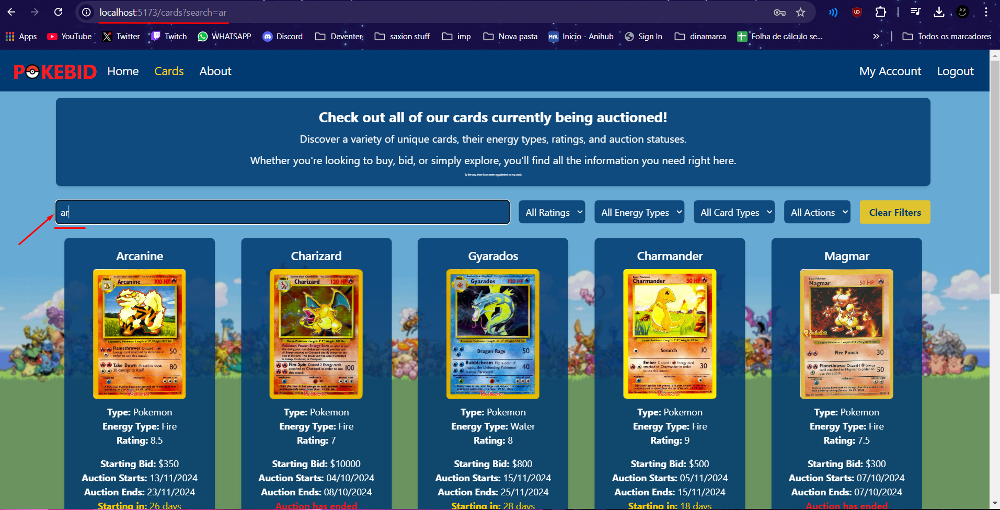

# Testing

> Place your test plan, test report and traceability matrix here

## Traceability matrix

### Functional

The table below shows an overview of which test covers which functional requirements

| Test | F1 | F2 | F3 | F4 | F5 | F6 | F7 | F8 | F9 | F10 | 
|:----:|:--:|:--:|:--:|:--:|:--:|:--:|:--:|:--:|:--:|:---:|
|  T1  | X  |    |    |    |    |    |    |    |    |     | 
|  T2  |    |    | X  |    |    |    |    |    |    |     |
|  T3  |    |    |    |    |    |    | X  |    |    |     |
|  T4  |    | X  |    | X  |    |    |    |    |    |     |
|  T5  |    |    |    |    | X  |    |    |    |    |  X  |  
|  T6  |    |    |    |    |    |    |    | X  | X  |  X  |
|  T7  |    |    |    |    |    |    |    |    |    |     |

### Non funtional

The table below shows an overview of which test covers which non-functional requirements
##### Unst = (untestable) not able to test it.

| Test | NF1 | NF2 | NF3 | NF4 | NF5 | NF6 | NF7 | NF8 | NF9 | NF10 | NF11 | NF12 | NF13 | NF14 | NF15 | NF16 | NF17 | NF18 | NF19 | 
|:----:|:---:|:---:|:---:|:---:|:---:|:---:|:---:|:---:|:---:|:----:|:----:|:----:|:----:|:----:|:----:|:----:|:----:|:----:|:----:|
| Unst |  X  |  X  |  X  |  X  |     |     |     |     |  X  |  X   |  X   |      |  X   |  X   |  X   |      |  X   |      |      |
|  T1  |     |     |     |     |     |     |     |     |     |      |      |      |      |      |      |      |      |      |      |
|  T2  |     |     |     |     |     |  X  |     |     |     |      |      |      |      |      |      |      |      |      |      |
|  T3  |     |     |     |     |  X  |     |     |     |     |      |      |      |      |      |      |      |      |      |      |
|  T4  |     |     |     |     |     |     |     |     |     |      |      |      |      |      |      |      |      |      |      |
|  T5  |     |     |     |     |     |     |     |     |     |      |      |      |      |      |      |      |      |      |      |
|  T6  |     |     |     |     |     |     |     |  X  |     |      |      |      |      |      |      |      |      |  X   |      |
|  T7  |     |     |     |     |     |     |     |     |     |      |      |  X   |      |      |      |      |      |      |      |

## Test plan
PREREQUISITE FOR TESTS: The website is launched and running for the tests to be executed.
Run the website by performing `npm install` for both the `front-end (client)` and `backend (server)`.
Then go to [front-end package.json](../client/package.json) and click `start` to start the front-end.
Then go to [back-end package.json](../server/package.json) and click `start (1)` to start the back-end.
After that you can start the tests and the website should be running.

Website should be running on `http://localhost:4173/`

### Test Case 1
Name: User can view 5 auctions on the main page.  
Requirement: F1

1. Open the website
2. Check if you can see 5 auctions on the main page

Expected Result: On the main page you can see 5 auctions.  

### Test Case 2
Name: User wants to view all available auctions and search on auction name.  
Requirement: F3, NF6

1. Open the website
2. Log in to the website / Register for an account if you don't have one
3. Go to the cards page
4. Search for an auction by name on the search bar

Expected Result: You can view all available auctions from your search.  

### Test Case 3
Name: User wants to filter auctions on at least 3 parameters.  
Requirement: F7, NF5

1. Open the website
2. Log in to the website / Register for an account if you don't have one
3. Go to the cards page
4. Filter auctions on at least 3 parameters on the filter boxes

Expected Result: You can view all available auctions from your filtering.  

### Test Case 4
Name: User wats to see all the information about an auction.  
Requirement: F2, F4

1. Open the website
2. Log in to the website / Register for an account if you don't have one
3. Go to the cards page
4. Click on your desired auction
5. Check if you can see all the information about the auction
6. Check if you can see the bids placed on the auction

Expected Result: You can view all the information about the auction and cant delete or modify the bids.  

### Test Case 5
Name: Admin wants to edit or add an auction with bad weather tests and fails.  
Requirement: F5 , F10

1. Open the website
2. Log in to the website as an admin
3. Go to the dashboard page 
4. Click on the edit button of an auction
5. Change the auction information
6. Alter the auction information to something that is not allowed(bid amount < 20 €, name < 3 characters, end date < start date)
7. Click on the save button
8. Check if you get an error message

Expected Result: You can edit or add an auction and get an error message when you try to alter the auction information to something that is not allowed.  

### Test Case 6
Name: User and Admin want to place a bid on an auction and see the bid in real time.  
Requirement: F8, F9, F10, NF8, NF18

1. Open the website in two different browsers
2. Log in to the website as a user in one browser and as an admin in the other
3. Go to the cards page in both browsers
4. Click on the same auction in both browsers
5. Place a bid in the user browser
6. Check if the bid is visible in the admin browser
7. Place a bid in the admin browser
8. Check if an error message is displayed in the user browser

Expected Result: You can place a bid  as a user and see the bid in real time being updated in the admin browser and get an error message when you try to place a bid as an admin.  

### Test Case 7
Name: New user wants to register for an account.  
Requirement: NF12

1. Open the website
2. Click on the register button
3. Fill in the registration form with valid information
4. Click on the register button
5. Check if you are logged in

Result: You can register for a new account, and you will be logged in after registration.  

## Test report

Here you can find the results of the tests that were executed. 
Tester: Rafael Tavares WEBSITE MAKER 😎  
Date: 18-10-2024 

### Test Case 1
Name: User can view 5 auctions on the main page.  
Status: Success

 

### Test Case 2
Name: User wants to view all available auctions and search on auction name.  
Status: Success

 

### Test Case 3
Name: User wants to filter auctions on at least 3 parameters.  
Status: Success

 

### Test Case 4
Name: User wats to see all the information about an auction.  
Status: Success

 

### Test Case 5
Name: Admin wants to edit or add an auction with bad weather tests and fails.  
Status: Success

 

### Test Case 6
Name: User and Admin want to place a bid on an auction and see the bid in real time.  
Status: Success
 
 

### Test Case 7
Name: New user wants to register for an account.  
Status: Success

 
 

